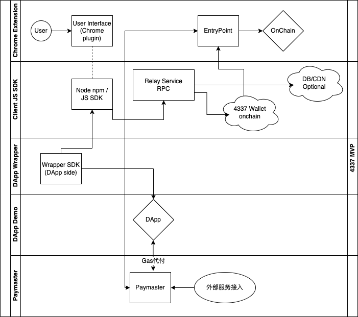
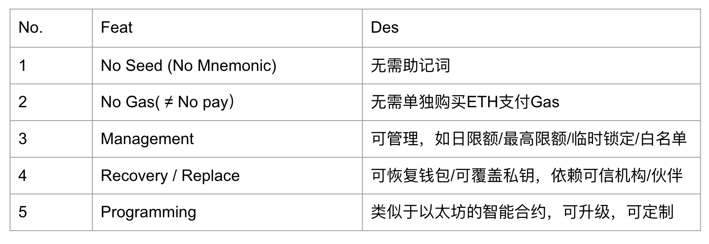
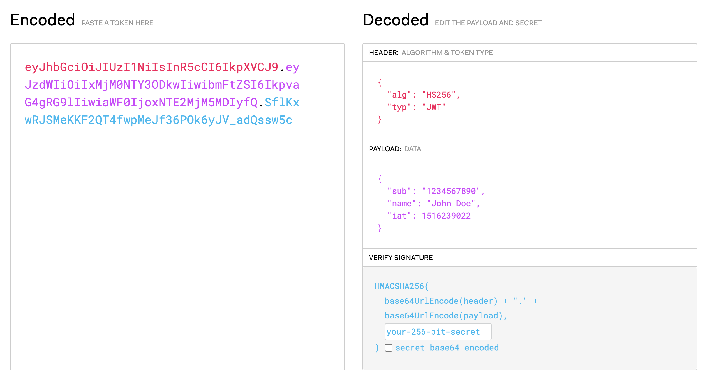
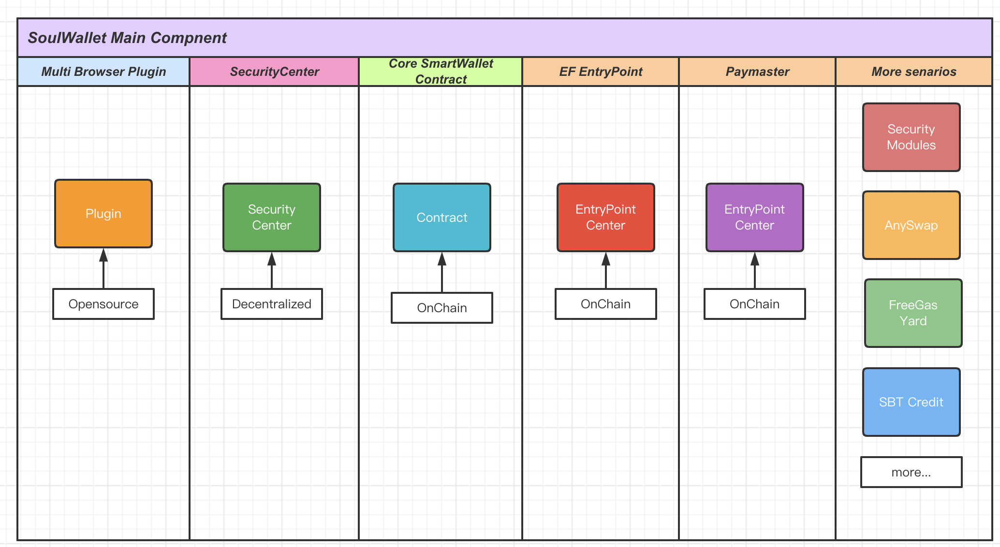
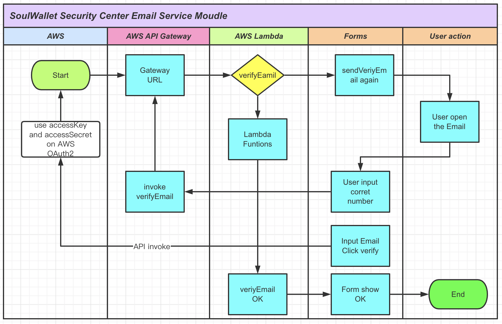
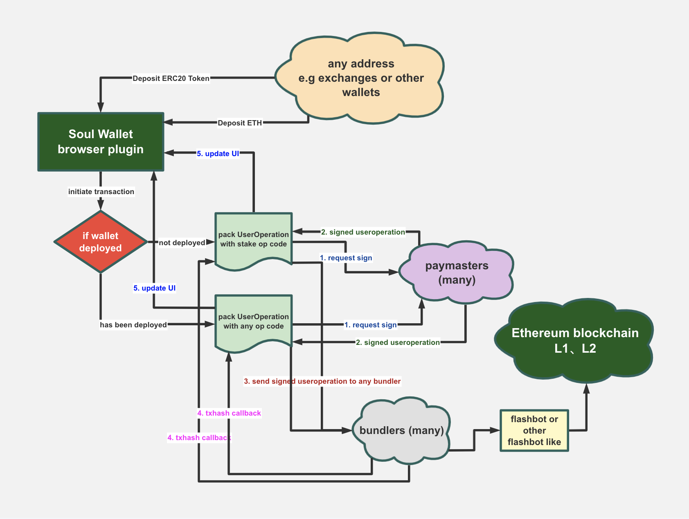

/*
 * @Author: jhfnetboy 
 * @Date: 2022-07-22 10:17:18 
 * @Last Modified by: jhfnetboy
 * @Last Modified time: 2022-07-25 12:12:47
 */
  
# 4337 Technical Implementation Analysis
+ This article will analyze and preview the entire main technical process from the perspective of technical implementation.
## Structure diagram of main scenarios
+ 
+ We can find many Entities and Lines which represents objects and relations.
+ Now we give a deification of this Objects and Relations.
### User
+ Who focus on some features of Smart Contract Wallets.
+ 
+ He can easily find the Chrome extension in official links or search engines.
+ Follow the next to install and fast create his account.
+ So he must want the highlight words to tell him what you have got and what benefits you are enjoying.
+ Set his **guardians** and remember it to reset the private key.
+ His private key will save in local machine.
### Plugin
+ It will not be very large and automate to update to new version.
+ It will give the owner some warnings or notifies to give advice and selections.
+ It give save mode or expert mode or some other modes for saving your time.
+ It will be Chrome and webkit engine browser adapted(Brave,Edge,Firefox...).
### Entry Points
+ It will be EF official address and can be directly verified.
+ We will give a overview of the abilities.
### Chain Network
+ It will be used on Layer1 (Mainnet) and Layer2(EVM adapted, Optimism, Arbitrum).
+ It won't need to select Chain Network? auto adapted and notify?

## The whole process of signing
## Other signature algorithms
## EOA and EIPS
+ We find the EIPs implementing a basic EOA wallet.
### EIP165
+ To receive the NFT assets.
+ https://github.com/ethereum/EIPs/blob/master/EIPS/eip-165.md
### EIP1193
+ To interact with the browser and implement a wallet
+ https://github.com/ethereum/EIPs/blob/master/EIPS/eip-1193.md
## Account abstract EIPs
### EIP1217
https://github.com/ethereum/EIPs/blob/master/EIPS/eip-1217.md
### Argent about
inpage.model.ts

#### EIP-747:

https://github.com/ethereum/EIPs/blob/master/EIPS/eip-747.md

#### EIP-3085

https://github.com/ethereum/EIPs/blob/master/EIPS/eip-3085.md

#### EIP-2470:

+ https://github.com/ethereum/EIPs/blob/master/EIPS/eip-2470.md
+ Create2Factory?

#### EIP-3085

https://github.com/ethereum/EIPs/blob/master/EIPS/eip-3085.md

#### EIP-2645
+ wallet.service.ts
+ from https://github.com/ethereum/EIPs/blob/master/EIPS/eip-2645.md
+ It was published on 2020-05-13 and be stagnant, a ERC application layer.
+ It seems needing to alter the GETH or other client's EVM OpCode to upgrade to support this EIP.
+ So...huge cost stop this.
+ The author was from starkware:
+ Tom Brand <tom@starkware.co>, Louis Guthmann <louis@starkware.co>

#### JWT
+ https://jwt.io/, IETF: https://tools.ietf.org/html/rfc7519
+ A JSON Object which after verified by server or on-chain contract, keeping in client(browser side), No status, No permission to store private data(must be encrypted).
+ 
## EOA initiates transaction
## Transaction Links and MEVs
## 4337 Protocol Interpretation
## Entryporint and Bundler
## 4337 Tx execution process

## SoulWallet Main Compnent
+ 
## Security Center
### Email Service
+ 
## technical interaction
+ 
