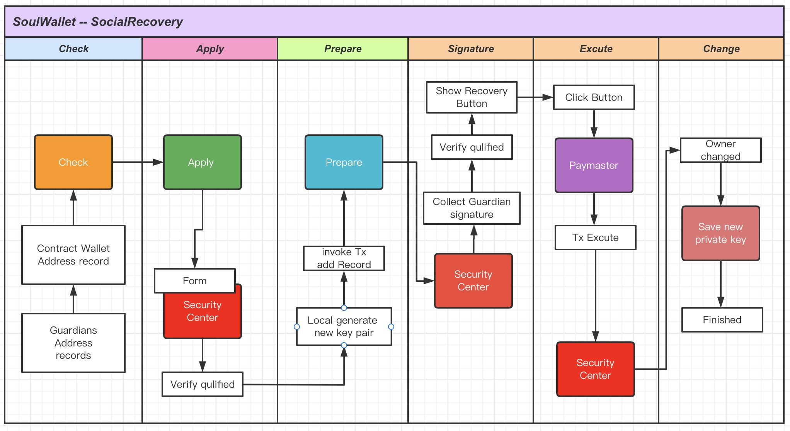

## SoulWallet Social Recovery 方案分析

本文阐述清楚PoC阶段我们要实现的Social Recovery的逻辑流程和基本交互，并给出基于当下PoC的Social Recovery流程的演进思路。

### 假设

1.EOA user 如果了解到SoulWallet的**安全提升和体验改善**，会愿意**支付**部分额外成本（部署钱包合约和略高的gasfee,但可以通过[聚合交易](https://twitter.com/VitalikButerin/status/1554983955182809088)来降低成本）。

2.Social recovery是Soulwallet钱包基于**EIP4337协议**为基础，开发的**应用产品**，会基于4337特性，构建更安全更便利的钱包体验。

3.对于SoulWallet user来说，可以无视Web2或者Web3，自由使用自己的**数字社会关系**来进行Social recovery。

### Poc阶段Social Recovery

1.可以设定多个Guardian，**默认1/2**以上Guardian签名确认，则可以Social Recovery，未来有**更多**安全配置可选。

2.Social Recovery Step：确认具备恢复信息-->发起恢复请求-->恢复准备阶段>Guardian到安全中心签名-->恢复条件具备-->支付Gas恢复。

3.未来：Social Recovery过程和安全总新透明**开源、可去中心**，无需可，可自建安全中心，以确保我们的安全中心可信和真正去中心。

#### 检查Step

SoulWallet user需要**记录**下来自己的合约钱包地址，这个可以发Email给自己，或者打印出来，或者加密记录到电脑。

还需要**记住**自己设置的Guardian，例如设置的Email、Twitter、可靠朋友的EOA，未来会提供默认Guardian服务，保障基础安全。

这样才能确保可以到安全中心发起SoulWallet

#### 申请Step

访问安全中心，输入Email（未来更多验证恢复方式），申请发送验证码，收到验证码输入到验证框，点击验证后自动发起恢复。

对于忘记自己发起SoulWallet的验证邮箱的，未来提供单独依靠钱包地址申请Guardian恢复，提供可配置的3/6,5/8等不同安全级别保障。

#### 准备Step

本过程在安全中心后台和合约层执行，以2/3为例，发起后记录交易申请（直接发链上交易？），获取签名后准备恢复。

未来：Email、Tiwtter等类别Guardian，会使用DKIM和Tiwtter API 加密方式，获取指定邮件的Email回复或者Titter回复？

Guardian地址可以选择SoulWallet user 私密存储，然后到安全中心提交地址恢复，也可以公开存储到链上，两种选择，目前公开。

#### 签名Step

Guardian到安全中心后，查看发给自己的恢复交易，进行**签名**，Gas支付参考最后一步。

安全中心完成恢复请求登记，**判断**是否达标2/3，本次PoC只进行一次Guardian验证，生成恢复按钮。

#### 执行Step

安全中心判断**签名数量**符合，条件具备，生成**恢复按钮**，需要SoulWallet user 或者某Guardian点击。

点击后提交签名到合约，判断符合恢复条件，恢复新的**密钥对**给SoulWallet user，需要下载备份。

恢复执行需要的Gasfee，可以是SoulWallet user预存在Paymaster的费用或者某个Guardian支付。

PoC使用SoulWallet user预存Gasfee**代扣**进行恢复，未来支持Paymaster swap或者credicard或者某Guardian**代付**。

### 概念定义和技术方案

#### 1.Gasfee支付

代扣：预存到Paymaster一定费用，有交易代扣，不用额外支付

代付：让其他钱包代付，或者其他DApp推广方代付（特定场景）

Swap：指定Token，Paymaster进行swap后代扣。

最终不是SoulWallet user支付，就是利益相关方（Guardian好朋友或者DApp赞助方）

#### 2.Guardian签名和验证

Guardian进行的是一次EOA的签名生成，是钱包插件提供的本地功能，也可以签名后提交链上存储。

对于签名验证和条件满足验证：

1. 当前是满足50%以上Guardian签名即可

#### 3.Guardian签名生成和Owner替换流程

1. 用户在soulwallet中生成新的私钥以及公钥
2. 用户打开我们的安全中心，填入合约钱包地址以及新的公钥，并生成一个唯一的url链接
3. 用户把这个url链接发给他的多个Guardian
4. Guardian打开url并通过网页连接soulwallet 点击“签名”按钮 完成签名，这个签名同时会保持并永久显示在此网页中
5. 等到Guardian签名量达到“Guardian签名和验证”的逻辑
6. 用户在这个网页中点击“一键恢复”按钮就可完成更换owner（合约钱包有余额的情况）
7. 用户通过这个网页连接metamask等钱包点击“一键恢复”按钮就可完成更换owner（合约钱包没有余额的情况需要借助EOA发起交易）

#### 4.Flow图

