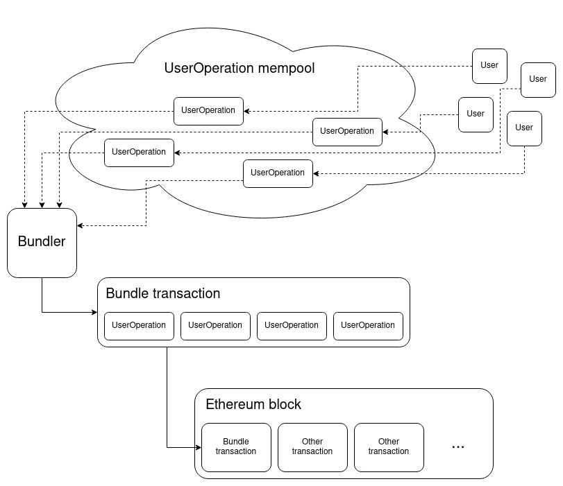
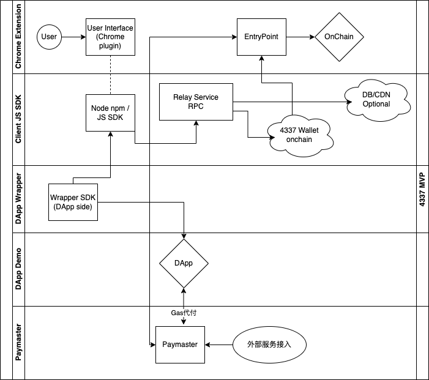
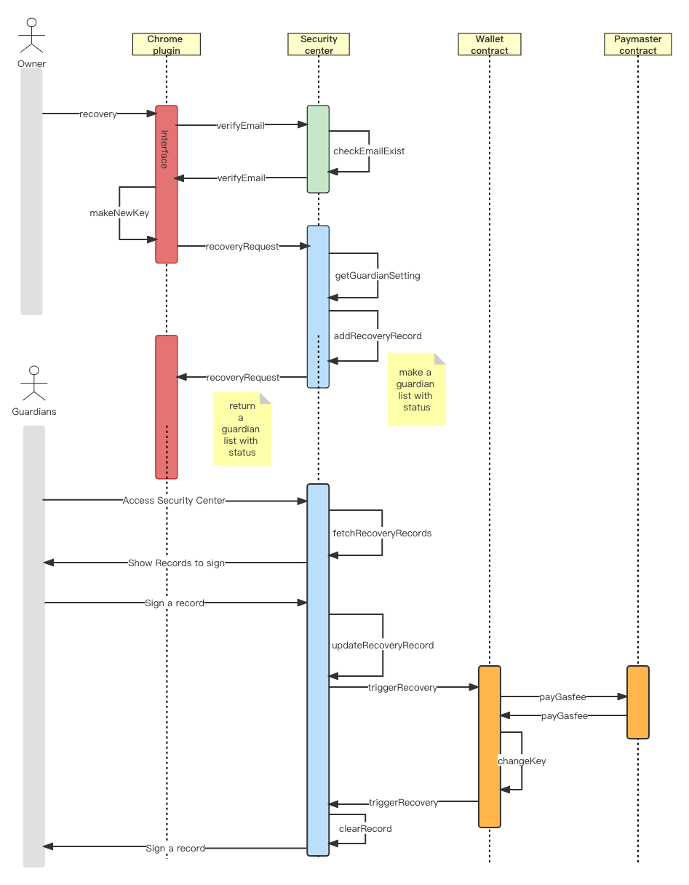

/*
 * @Author: jhfnetboy 
 * @Date: 2022-08-30 11:27:29 
 * @Last Modified by: jhfnetboy
 * @Last Modified time: 2022-09-04 19:45:49
 */

## SoulWallet technical abstraction
+ This document will show the technical solutions for team communications and partners' basic knowledge.
+ It will be modified timely.
### Conceptions
+ The article ([VB's article](https://medium.com/infinitism/erc-4337-account-abstraction-without-ethereum-protocol-changes-d75c9d94dc4a))has told us : smart contract wallet, entrypoint contract, paymaster contract, bundler client and more, are build from the [EIP 4337](https://github.com/ethereum/EIPs/blob/master/EIPS/eip-4337.md). 
+ We can see this for a over review:
+ 
+ We will have new features about multisig, [social recovery](https://vitalik.ca/general/2021/01/11/recovery.html).
+ We provide the ability of changing the control right of your wallet(secret key) within your social guardian's permission and without modifying anything of Ethereum. 
+ Conception architecture：
+ 
### Contract wallet
+ We need a wallet product to realize the mission we talking above based on what [infinitism](https://github.com/eth-infinitism/account-abstraction) has done.
+ It has some components maybe like this:
+ 
+ 
### Social recovery
+ The highlight, social recovery's draft flow  flow:
+  
### Security center
+ We need a security center to maintain the guardian settings and something else.
+ We will set the security center github repo to be open source, and anyone can run their own security center later.
+ Security center verify flow:
+ 
+ Security center sequence:
+ 

### Paymaster
+ Deposit paymaster sequence:
+ 
+ Verify paymaster sequence:
+ 

### More docs
+ [walletcore-dataflow](EIP4337-walletcore-dataflow.md)
+ [social-recovery](Social-recovery-solution.md)
+ [security-center](security-center-solution.md)
+ [Paymaster](Paymaster.md)
+ Old docs:
+ [Design](1-4337-wallet-design.md)
+ [Analysis](2-4337-wallet-tech-analysis.md)
+ [Project](0-project-design-QA.md)
+ Progress:
+ [Progress](../progress.md)
### Technical stack
+ Chrome plugin: Node.js/TS
+ Contract: Solidity
+ Security center: AWS Lambda /Node.js
+ 
### Product roadmap
+ 1. Signature aggregate.
+ 2. Default guardian and more guardian settings.
+ 3. @jiajun todo
### Scale and performance
+ All the repo of Github will be open source.
+ The contract will be deployed on Layer1 and Layer2, it depends on the Ethereum Sharding and more.
+ The Chrome plugin is depend on your local computer performance.
+ The Security center will be open source and decentralized by self-deployed.
+ It will be discussed in special topic later.
### Security and risk
+ Welcome to giving us any response for our MVP, or talking the detail of the product SoulWallet.
#### Security center
##### Risk 1
It is a central application to service for the SoulWallet users, it a single point failure.
+ Bad: If the server is hacked and all data is leaked, the user's email and contract wallet address and guardian public key signature hash will be leaked, which will not directly cause customer losses.
+ Response: We will encrypted the data for leak risk. We will set monitor to block the malicious request(It depend on the request data and Model training). We build on OAuth2 and ECDSA to verify the good request.
+ 
#### Risk 2
+ If the server is hijacked, fake API will get the above data of the customer, but the signature is encrypted hash and cannot be cracked?
+ Bad: 
#### Risk 3
+ If the default Guardian is hacked with the private key hash or private key, it is a risk for the one with only one guardian, so it is safer to need at least 2 guardians.
#### Risk 4
+ Therefore, for customers larger than 10000U, it is recommended to set both Web2+Web3 guardian, preferably 3/5, which is safer.
#### Risk 5
+ And record the wallet and guardian address on the disconnected mobile phone by yourself, and restore it in mac+chrome environment when it is restored.
#### Risk 6
+ In addition, the private key can be recovered once on a regular basis, and the single-day limit+account-moving warning is set, so that the minimum loss is basically controlled, and the private key can be changed in time after being stolen, and the control right can be restored.
#### Risk 7 
+ Large account, convenience and security are required. You can purchase officially audited security module+security service.

## SoulWallet components and team's role
### PD
+ User scenario define and logic define by @zengjiajun, who was the summoner.
### PM
+ Service for the team delivery @jhfnetboy, who was a experienced guy on IT area.
### Plugin
+ https://github.com/proofofsoulprotocol/soul-wallet-plugin
+ Plugin Hooks: will be draft define in monday, support basic hooks like utils, contact 
+ common query, jhf, Rory, cejay
+ @zeno Our designer, UI,figma , a cool guy.
+ @robbie Frontend plugin and invoke js sdk, a good boy.

### Hooks
+ https://github.com/proofofsoulprotocol/soul-wallet-plugin/tree/main/src/sdk
+ Node.js npm package and signature and js sdk @cejay 
### Security center
+ Backend Service: some basic service like Email verify, recovery execution and more.
+ Security center and more, backend job @jhfnetboy, yeah, also a fullstack engineer.
+ https://github.com/proofofsoulprotocol/soulwallet-backend
### Wallet Contract Core
+ Wallet Contract Core: user case support,
+ @Davidding  a handsome dad who was a Solidity engineer.
+ @cejay ,a good man who was fullstack Web3 builder. 
+ https://github.com/proofofsoulprotocol/soul-wallet-contract
### Wallet Core Lib
+ Wallet Core Lib(js SDK for Plugin invoke): following the contrace core, support user case to invoke, cejay
+ https://github.com/proofofsoulprotocol/soul-wallet-corelib

### Wallet Paymaster
+ Wallet Paymaster: support user case, design and dev, contract coding
+ @cejay @Davidding
+ https://github.com/proofofsoulprotocol/paymaster-server

### Wallet Bundler
+ Now do few jobs on this, to be extended.
+ @cejay @Davidding
+ https://github.com/proofofsoulprotocol/paymaster-server

### Mobile Apps
+ In iOS and Android and other platforms, we invite our companion team: Astrox.
+ To finished the Mobile apps based on what we have done.

## Next step
### Tech stack
+ After the MVP delivery, we will build a small community to get the response and advice for SoulWallet, to get more ideas for product detail.
+ We will base on @Mask 's years technical accumulation to develop our product version.
+ Thanks for the Open Source spirit on @Mask and special thanks for @yisi @gaoyuan.

### Team
+ We will recruit new guys (fulltime first) to join us to build the SoulWallet product version.
+ We will build cooperations with other great teams like Astrox, to build AA and SoulWallet together.

### Venture
+ Yeah, we need money, but not so much for a small team.
+ Maybe we will raise a round for product version developing.
+ Contact @zengjiajun @jhfnetboy at twitter.